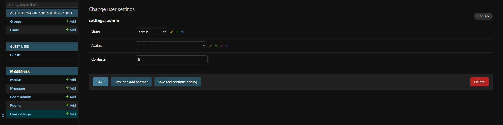
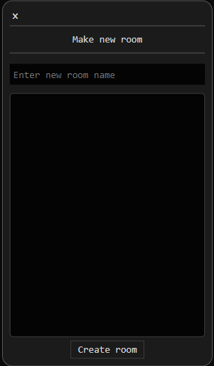
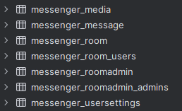
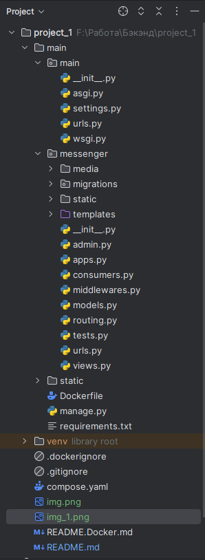

Web-Messenger
---


---
# Showcase

Try it for yourself http://77.222.37.206:8000/messenger/


# Setup

```diff
- Attention! Setup is essential and must be done in order to have the Messenger functioning at all.
```

## Docker

Compose the cluster

```console
root@foobar:~# docker-compose build
root@foobar:~# docker-compose up
```

Then you should see the services logs. It indicates that the cluster is functioning

```console
Example:
web-1    | 2024-05-13 08:07:35,615 INFO     Starting server at tcp:port=8000:interface=0.0.0.0
web-1    | 2024-05-13 08:07:35,617 INFO     HTTP/2 support not enabled (install the http2 and tls Twisted extras)
web-1    | 2024-05-13 08:07:35,617 INFO     Configuring endpoint tcp:port=8000:interface=0.0.0.0
web-1    | 2024-05-13 08:07:35,619 INFO     Listening on TCP address 0.0.0.0:8000
```

After that, you must enter the web container terminal.

I do it like this:
```console
root@foobar:~# docker ps
CONTAINER ID   IMAGE                     COMMAND                  CREATED          STATUS          PORTS                                          NAMES
038b2e0a08f2   basic-web-messenger-web   "daphne -b 0.0.0.0 -…"   3 minutes ago    Up 3 minutes    0.0.0.0:8000->8000/tcp, :::8000->8000/tcp      basic-web-messenger-web-1
543608ac413a   postgres:latest           "docker-entrypoint.s…"   9 minutes ago    Up 3 minutes    0.0.0.0:5432->5432/tcp, :::5432->5432/tcp      basic-web-messenger-db-1
a8761cb3900a   redis:latest              "docker-entrypoint.s…"   9 minutes ago    Up 3 minutes    0.0.0.0:6379->6379/tcp, :::6379->6379/tcp      basic-web-messenger-redis-1
697cdb9e5903   portainer/portainer-ce    "/portainer --admin-…"   21 minutes ago   Up 20 minutes   8000/tcp, 9443/tcp, 127.0.0.1:9000->9000/tcp   portainer
root@foobar:~# docker exec -it 038b2e0a08f2 bash # ID of the ...-web servie
```
In the container's terminal do this:
---
Run the migrations and collect static:
```console
root@foobar:/app# python manage.py createmigrations
root@foobar:/app# python manage.py migrate
root@foobar:/app# python manage.py collectstatic
```

And create Django-superuser:
```console
root@foobar:/app# python manage.py createsuperuser
Username (leave blank to use 'root'): admin
Email address:
Password: *****
Password (again): *****
Superuser created successfully.
```
Open the http://youthost/admin/

Log in and create UserSettings object for the admin user:



This is necessary because every user must have UserSettings. 
They are created automatically in the user registration process, 
but the superuser-creation does not trigger the user-creation views
and that's why we must create it for the Superuser manually.

The final step is to create the main room for every new user to join in.
Name it like you want.



You are good to go!


# Project structure

It utilizes PostgeSQL and Redis databases:

Django **settings.py**

```python
DATABASES = {  # Postges setup
    'default': {
        'ENGINE': 'django.db.backends.postgresql',
        'NAME': 'postgres',
        'USER': 'postgres',
        'PASSWORD': "",
        "HOST": "db",
        "PORT": "5432",
    }
}

CHANNEL_LAYERS = { # Channels' Redis channel layers setup 
    'default': {
        'BACKEND': 'channels_redis.core.RedisChannelLayer',
        'CONFIG': {
            "hosts": [f"redis://redis:6379"],
        },
    },
}
```

Postgres tables:



## File structure




# Known issues
## Bugs
1. First messages in the newly created room do not show themselves
2. Strange behavior of the file uploading. It looks like even the smallest
internet connection drops cause the file uploading to cancel and 
a send message will lose its media content.
## Missing or undeveloped features
1. Message deletion and editing
2. User's contacts list of other users 
